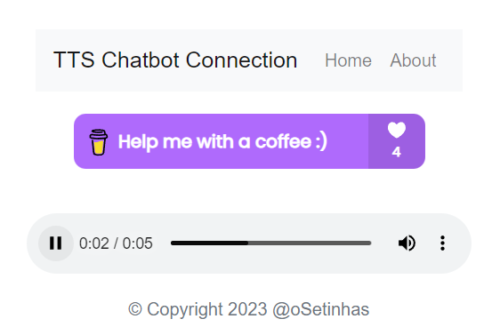

Your support means the world to me! :heart:

☕ [Buy me a coffee to support me](https://www.buymeacoffee.com/osetinhas) ☕

And join our discord community:

[https://discord.gg/pcxybrpDx6](https://discord.gg/pcxybrpDx6)

# ChatGPT Twitch Bot

This is a simple Node.js Chat bot with ChatGPT Integration based on the simplest possible nodejs api using express that responds to any request with: Yo!

It considers a context file for every message so you can give it background information about your stream, your socials, your stream rewards, stream currency and so on. 

You can choose if you want it to run in prompt mode (without context of previous messages) or in chat mode (with context of previous messages).

# How to use

## 1. Fork this on Github
Login with your github account and fork this repository to get your own copy of it. 

---

## 2. Fill out your context file
Open the file file_context.txt and write down all your background information for GPT. 

The contents of this file will be sent every time somebody enters your chat command. This will increase the cost of every request with every word you put in, but can still be pretty lengthy. 

---

## 3. Create an openAI account
Go to https://platform.openai.com and create an account. 

Initially you will get a free contingent to use but later on you will have to pay for the server usage. 

You can set a spending limit here: https://platform.openai.com/account/billing/limits

---

## 4. Get your openAI Secure Key
Go to https://platform.openai.com/account/api-keys

Press "Create new secret key"

Save that secret key somewhere safe. 

You will use this key to authorize your version of this chatbot with openai. 
<strong>Treat this as the key to your wallet.</strong>

---


## 5. Deploy this repo on Cylic or Render for free

Render is the latest addition to our repo. With Render you can have a server running 24 hours a day for free.
You **WON'T** need to use NIGHTBOT or STREAMELEMENTS to host your bot anymore!
By default the messages will be answered by a bot called *oSetinhasbot* but you can change it to your own bot name.
Check 

Cyclic is our old approach with certain limitations. You can still use it if you want to.
You will have to use NIGHTBOT or STREAMELEMENTS to host your bot, and they have a **10seconds timeout**.
Also, Twitch has a **400 character limit** on chat messages, so you will have to use the !continue command to continue a conversation.

Press the button to deploy this on Cyclic or Render.

### 5.1. Deploy to Render

[](https://render.com/deploy)

### 5.2. Deploy to Cyclic
    
[](https://deploy.cyclic.app/)

### 5.3. Login with Github

Log in with your Github account there and select your twitch-chatgpt repository for deployment. 

These services are free to use and only very big streams will run into issues with their request contingent.

---

## 6. Set your environment variables
Go to the variables/environment tab in your deployment. 

Create 3 new variables. The exact spelling of these variables is important:

### 6.1. Required Variables for both Render and Cyclic

1. _**OPENAI_API_KEY**_
  - This is where you paste your openAI Secure Key.

### 6.2 Required Variables only for Render

2. _**CHANNELS**_
  - This is where you put your twitch channel name.
  - If you have more than one channel, separate them with a comma. (e.g. channel1,channel2,channel3)
  - If the channel has FOLLOWERS-ONLY mode enabled:
    - create a GitHub issue requesting "oSetinhasBot" account to follow your channel.
    - connect your own account, see variable 7. and 8.

### 6.2. Optional Variables for both Render and Cyclic

3. _**GPT_MODE**_
  - (default: CHAT)
  - Accepts one of 2 values:
    - "CHAT" - Chat mode with history, cheaper than prompt mode but also faster. Uses gpt-3.5-turbo as model.
    - "PROMPT" - Prompt mode, no history. Uses text-davinci-003 as model.

4. _**HISTORY_LENGTH**_
  - (default: 3)
  - Accepts a number.
  - Only works when GPT_MODE is CHAT
  - Defines how many bot-user conversations will be saved and sent together with the most recent user message.
  - This gives ChatGPT the ability to remember things and allow conversations instead of static prompts.

5. _**MODEL_NAME**_
  - (default: gpt-3.5-turbo)
  - Accepts one of 2 values:
    - "gpt-3.5-turbo" - The default model. This is the fastest and cheapest model. It is also the least accurate.
    - "text-davinci-003" - Most expensive model.
    - "gpt-4" - Most accurate model and if you have the plan for it!

6.3. Optional Variables only for Render

6. _**COMMAND_NAME**_
  - (default: chat)
  - You can add an exclamation mark (!) before the command name to make look like a twitch command.
  - Accepts a string.
  - Defines the command that will be used to trigger the bot.

7. _**TWITCH_USER**_
This step can be complicated.
  - To get the necessary twitch user:
    - Go to https://dev.twitch.tv/console
    - Register your application
    - Fill a name for your application (this can be anything)
    - Set OAuth Redirect URL to https://twitchapps.com/tokengen/
    - Set Category to Chat Bot
    - Set Description to anything you want
  - Fill the TWITCH_USER variable with the name of your application

8. _**TWITCH_AUTH**_
  - Go to https://twitchapps.com/tmi/ and click on Connect with Twitch
  - Copy the token from the page and paste it in the TWITCH_AUTH variable  
  - ⚠️ THIS TOKEN MIGHT EXPIRE AFTER A FEW DAYS, SO YOU MIGHT HAVE TO REPEAT THIS STEP EVERY FEW DAYS ⚠️

Save the Changes.

## 7. Text-To-Speech (TTS) Connection

Your render url, for example:
- https://your-twitch-bot.onrender.com/

You will see the following web page, and it is directly connected to your twitch chat.

You can add it to your stream as a widget :)



---

If you used RENDER, you can stop here :)

---

## 7. Get your API Link from Cyclic
Copy the link cyclic provides for you. 

You can find it in the top left corner below the title of your deployed repository.

---

## 8. Add your API Command to your Chatbot
Now it is time to build your Chat-Command. 


### Streamelements
Go to your Streamelements Dashboard -> Chatbot -> Commands -> Custom Commands.

Create a new command.

Enter the following in the response field:
```
$(urlfetch https://your-cyclic-url.app/gpt/"${user}:${queryescape ${1:}}")
```
Replace "your-cyclic-url.app" with the url you copied in step 7

Enjoy your command. 


### Nightbot
Go to your commands page and add a new command.

Enter the following in the message field:

```bash
$(eval "$(urlfetch https://your-cyclic-url.app/gpt/"$(user):$(querystring)")"; ' ')
```
Replace "your-cyclic-url.app" with the url you copied in step 7

Enjoy your command. 

## Extra commands

### !continue
Twitch has a 400 character limit on chat messages. 
If you want to continue a conversation, you can use the !continue command.

$(urlfetch https://your-cyclic-url.app/continue")
